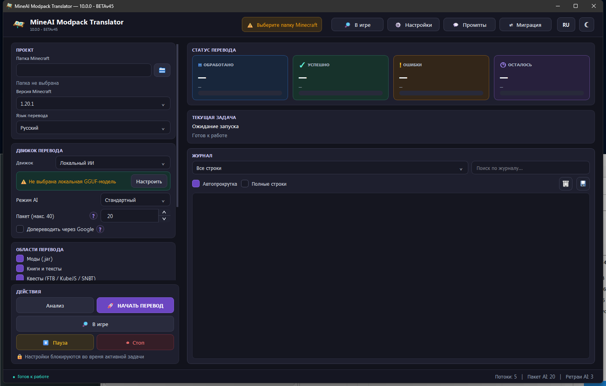
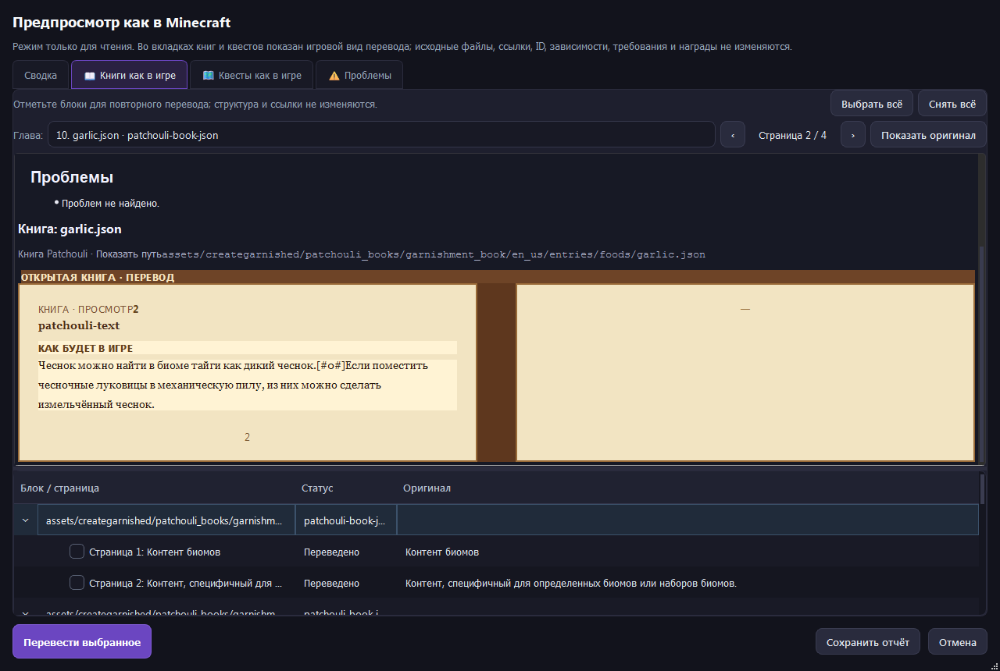
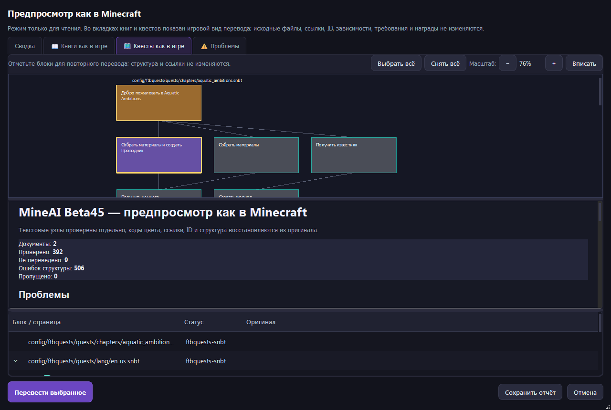

# 🌍 MineAI Translator (Minecraft Modpack Localizer)

[](https://github.com/Evg-Yustus/MineAI-Modpack-Translator-TEST/releases/latest)
[](https://github.com/Evg-Yustus/MineAI-Modpack-Translator-TEST/actions/workflows/tests.yml?query=branch%3Abeta45)
[](https://www.python.org/)
[](#license)

*Read this in other languages: [Русский](#-mineai-translator-локализатор-сборок-minecraft)*

**MineAI Translator** is a desktop application for translating Minecraft modpacks
(mods, quests, skills trees, and guidebooks) into **11 languages** while keeping
the technical structure byte-safe.

The translator separates visible text from Minecraft syntax before sending a
request. Variables such as `%s`, JSON locators, Markdown links, item tags,
SNBT/FTB Quest references, colour codes, numbers, and whitespace are restored
from the original skeleton after translation. This keeps resource-pack and
datapack output compatible with the source mod.

## 🌍 Multi-Language Support
You can translate your modpack from English into any of the following languages:
**Russian, Spanish, German, French, Simplified Chinese, Japanese, Portuguese, Italian, Polish, Korean, and English (UK).**

## 🖥️ Beta45 interface

The current build uses a resizable PyQt6 interface. Select the Minecraft
directory, choose the translation scope and provider, then start the run from
the dashboard. The **In-game view** opens a read-only preview with the same
semantic units used by the translator.

### Main dashboard



### Book preview



The book view supports registered formats (including Patchouli, Modonomicon,
Immersive Engineering manuals, GuideME/Markdown and Oracle Index), chapter
selection, multi-page navigation, Minecraft colour codes and an original/
translation toggle.

### Quest preview



The quest view shows readable quest titles and dependency cards. Zoom, graph
selection and the unit list stay linked, while the problem report identifies
untranslated or structurally damaged text without exposing internal IDs in the
game-facing view.

---

## 📥 Installation & Usage (Download .exe)

You don't need to install Python or mess with code! You can download the ready-to-use application.

1. Go to the [Releases](https://github.com/Evg-Yustus/MineAI-Modpack-Translator-TEST/releases) tab on the right.
2. Download the latest **`MineAI_Translator_Beta45.exe`** file.
3. Place it in a convenient folder and run it with a double click.

*(For advanced users and developers, instructions on running from source code are at the bottom of the page).*

---

## ✨ Key Features

* 🛡️ **Format Protection (Titanium Shield):** Smart regular expressions protect macros `$(#AE)`, tags `<item:minecraft:dirt>`, Markdown links `](url)`, and YAML headers (`---`) from being corrupted by the translator.
* 🧪 **Lossless audit:** Before a cached or existing translation is reused, MineAI checks numeric fragments, links, color-code boundaries, list delimiters and residual source words. Invalid values are queued for repair automatically.
* 🛠️ **Auto-Fix Cache:** Machine translators often make mistakes (e.g., adding spaces in variables: `% s` instead of `%s`). On every run, the program scans its cache and **automatically fixes** broken brackets, links, and variables, ensuring perfect formatting.
* ♻️ **Cache Recovery Mode:** A dedicated checkbox validates old caches per entry and restores translations through `AI cache → Google cache → local AI → Google fallback`, without discarding the whole cache.
* 🧩 **Deterministic Book Recovery:** If a model loses a protected marker in a large page, MineAI translates only the visible segments and rebuilds the original FormatKit skeleton itself instead of leaving the page in English.
* 💬 **Patchouli Tooltip Translation:** Visible text inside `$(t:...)` tooltips is translated while the surrounding game syntax remains byte-stable.
* 📖 **Custom Dictionary (`dictionary.json`):** The program automatically generates a dictionary file. If the translator stubbornly translates "Raw Copper" incorrectly, just add a rule to the dictionary, and the script will automatically replace it throughout the entire modpack!
* 🧠 **Local AI Support:** Integration with KoboldCPP, LM Studio, Ollama and Llama/llama.cpp. All local providers share the same clean lossless transport, batch limits, cache repair, pause/cancel, validation and Google fallback.
* ☁️ **Cloud AI via OpenRouter:** Connect elite neural networks (like Qwen, Claude, or GPT) in one click without using your video card.
* ⚡ **Resilient Google fallback:** A `429` on the unofficial GTX endpoints is
  switched immediately to Google's mobile frontend (`/m`) instead of creating
  a retry storm. Temporary 5xx/network errors still use bounded retries.
* 🔎 **Readable quest preview:** The preview shows quest names from FTB/SNBT, JSON language catalogs and other chapter files, and labels each dependency by the other quest's name; task and reward IDs are not displayed as quests. A stable short fallback is shown only when a title is truly absent.
* 🖼️ **Interactive preview repair:** Books are shown page by page in a Minecraft-like view, quests have a dependency graph, and the issue list lets you check individual text units and send only those units for a safe retranslation.
  The preview uses the FormatKit registry for every supported book adapter (Markdown/GuideME, IE manuals, Patchouli JSON, Modonomicon JSON, Oracle Index MDX/JSON and locale-free guidebook trees), including books discovered outside a JAR. Quest rows and graph cards are bidirectionally linked: clicking either side selects, scrolls to and highlights the same quest; direct dependencies receive a separate highlight color. The graph can be zoomed with the mouse wheel or `−/+` controls, while books are rendered as readable Minecraft-like pages with a chapter selector, page arrows, original toggle and safe clickable links to discovered chapters. Multi-page books remain fully navigable; unresolved links are marked without changing their source text. The window is resizable and does not keep a stale busy cursor.
* ⚡ **High Speed:** When using Google Translate, the program sends requests in batches using multi-threading, translating thousands of lines in minutes.
* 📦 **Safe Packaging:** The program generates a ready-to-use resource pack and a verified master datapack without damaging original `.jar` files or `minecraft/kubejs/data`.
* 🧩 **FTB Quests skeleton:** Quest language overlays are rendered from the English structure; valid list lines are retained, failed lines stay in their original slots, and `] ]`/format-code spacing cannot be written into the target.
* 🧠 **Puffish Skills trees:** Paxi, KubeJS, OpenLoader and regular datapack skill trees are detected with the quest scope. Only visible titles/descriptions are translated into a datapack overlay; graph coordinates, connections, requirements, rewards and IDs are copied from the English source unchanged.
* 🌍 **Per-world Datapacks:** At the end of a successful run, the same datapack is atomically installed into every existing `saves/<world>/datapacks` directory. Worlds are recognized by `level.dat`; unrelated folders are ignored.
* 📜 **Stable Modonomicon Localization:** Literal book text receives deterministic `DescriptionId` keys. English and translated values live in the resource pack, while the datapack contains only stable keys and original technical structure.

---

## 🎛️ Processing Modes

The program offers three processing modes to adapt to any situation:

1. **Append (Keep old translations)**
   * *How it works:* Finds only **new, untranslated lines** and translates them, leaving your existing translations untouched.
   * *Why use it:* Perfect for updating a modpack! If a mod updates with 50 new items, it translates only those in seconds.
2. **Skip (If 90%+ done)**
   * *How it works:* If a mod is already 90% or more translated, the program skips it entirely.
   * *Why use it:* Saves time on massive modpacks where authors might have left a few technical lines untranslated.
3. **Force (Translate from scratch)**
   * *How it works:* Completely ignores existing translations and re-translates all text from scratch.
   * *Why use it:* If the current translation is terrible (machine-translated) and you want to rewrite it using a high-quality AI.

---

## ⚙️ Strategy: How to Get the Perfect Result

For the best quality, a **combined approach (Creating two resource packs)** is recommended.

### Step 1. Interface Translation (Fast & Technical)
Mod interfaces (item names, simple descriptions) don't require literary talent.
1. Select **only "Interface (Mods)"**.
2. Engine: **Google** | Mode: **Append**.
3. Name the resource pack: `Mods_UI_Translated`.
*Result: In 2-3 minutes, you will translate 90% of the modpack (tens of thousands of lines).*

### Step 2. Quests and Guidebooks (Lore & High Quality)
Books and quests contain stories and jokes. Google will translate them poorly. This is where AI shines!
1. Select **"Guidebooks" and "Quests"** (uncheck Interface).
2. Engine: **AI Provider** (Local AI or OpenRouter) | Mode: **Force** (to overwrite bad old translations).
3. Name the resource pack: `Quests_Lore_Translated`.
*Result: The text will read like a well-written book.*

> 💡 **How to use in-game:** Place both archives in your `resourcepacks` folder. Enable both, but **put `Quests_Lore_Translated` ABOVE `Mods_UI_Translated`**.

---

## 🗃️ Isolated Caching System

To avoid translating the same lines twice, the program uses a **dual independent cache**, as the styles of different engines vary:
* `cache.json` — Machine translation cache (Google/DeepL).
* `ai_cache.json` — High-quality AI translation cache (KoboldCPP, LM Studio,
  Ollama, Llama/llama.cpp or OpenRouter).
*If the program closes unexpectedly, you won't lose a single translated line.*

`dictionary.json` and `glossary.json` are user-editable files generated beside
the application on first launch. They are deliberately not embedded in the
EXE, so an update does not overwrite custom terminology. FTB Quests chapter
and reward files are read-only inputs: only visible title/description text is
written to a language overlay; item IDs, counts, dependencies, rewards and
other gameplay links are never sent to a translator or rewritten.

---

## 🤖 AI Configuration (Artificial Intelligence)

### Option 1: Cloud AI (OpenRouter) — Recommended for weak PCs
1. Get an API key at [openrouter.ai/keys](https://openrouter.ai/keys).
2. In **Settings → OpenRouter**, enter your key and the desired model ID (e.g., `google/gemma-2-9b-it:free` or `qwen/qwen-2.5-72b-instruct`).
3. In the main window, choose the **AI Engine** and select **OpenRouter (cloud)**.

### Option 2: Local AI (KoboldCPP)
The program launches the `koboldcpp.exe` engine itself (just place it in the `AI` folder). You only need to download a language model in **`.gguf`** format.

#### GPU Offloading
* **0 (CPU Only):** Runs on your processor (Slow).
* **10-50:** Balanced (Partially in VRAM, partially in RAM).
* **99 (Max):** Entire model loaded into Video RAM. Maximum speed.

#### Recommended Models (Format: Q4_K_M or Q5_K_M)
1. **Lightweight (7B - 8B)** *(Requires: ~6-8 GB VRAM)*:
   * Qwen 2.5 (7B): [Download from Hugging Face](https://huggingface.co/paultimothymooney/Qwen2.5-7B-Instruct-Q4_K_M-GGUF/tree/main)
   * Llama 3.1 (8B): [Download from Hugging Face](https://huggingface.co/bartowski/Meta-Llama-3.1-8B-Instruct-GGUF)
2. **Medium (14B)** *(Requires: ~10-12 GB VRAM)*:
   * Qwen 2.5 (14B): [Download from Hugging Face](https://huggingface.co/Qwen/Qwen2.5-14B-Instruct-GGUF)
3. **Heavyweights (32B+)** *(Requires: 16+ GB VRAM)*:
   * Qwen 2.5 (32B): [Download from Hugging Face](https://huggingface.co/Qwen/Qwen2.5-32B-Instruct-GGUF)

### Option 3: Local AI (LM Studio)
1. Start **Local Server** on the Developer page in LM Studio.
2. Open **Settings → LM Studio**. The default API address is `http://localhost:1234/v1`.
3. Load the required LLM in LM Studio and click **Refresh models**. MineAI fills
   the only loaded instance ID automatically or offers a list when several LLMs
   are loaded. Save the settings and choose **LM Studio** in the main window.

An API token is optional unless authentication is enabled in LM Studio. MineAI reuses the local HTTP connection between translation batches for lower request overhead.

### Option 4: Local AI (Ollama)
1. Start Ollama and make sure the required model is installed (for example,
   `ollama pull qwen3:8b`).
2. Open **Settings → Ollama**. The default API address is
   `http://localhost:11434/api`.
3. Click **Refresh models**. MineAI prefers models currently loaded by Ollama
   and falls back to the installed list, then select the model and save.

MineAI uses Ollama's non-streaming `/api/chat` endpoint. The same clean text
transport, batching, cache repair, validation, pause/cancel and Google fallback
used by LM Studio are applied automatically.

### Option 5: Local AI (Llama / llama.cpp server)
1. Start `llama serve` with a GGUF model (the server exposes an OpenAI-compatible
   API).
2. Open **Settings → Llama**. The default API address is
   `http://127.0.0.1:8080/v1`.
3. Click **Refresh models**, select the ID returned by `/v1/models`, and save.

An API token is optional when the server is configured with authentication. Llama
uses the same lossless transport and retry/fallback path as the other local
providers.

---

## 🛠️ Running from Source & Architecture

### Project Structure
```text
formatkit/            # Beta36 compatibility and semantic-unit layer
mineai_formatkit/     # Standalone structure-safe Minecraft FormatKit SDK
mineai/
  config.py           # settings.ini manager
  constants.py        # Languages, pack_formats, ignore lists
  text_processing.py  # Titanium shield masks, polish, smart glue
  json_utils.py       # Lenient JSON parser, book paths
  cache.py            # Thread-safe translation cache
  engines/            # Google, DeepL, KoboldCpp, LM Studio, Ollama, Llama, OpenRouter
  processors/         # JAR parsing, SNBT formatting, analysis
  output/             # Zip resourcepack/datapack building
  runtime/            # Translation jobs, AI launcher background thread
  gui_qt/             # Production PyQt6 interface
```

### How to Run:
1. Install Python 3.10+.
2. Run in terminal: `pip install -r requirements.txt`.
3. Launch the module: `python -m mineai`.

### How to Compile into .exe:
If you modified the code and want to build your own executable without a console window, simply run the provided batch file:
`build.bat`

The compiled standalone app will appear in the `dist/` folder as `MineAI_Translator_Beta45.exe`.

### FormatKit SDK

Beta45 keeps the semantic-unit pipeline, cache repair and read-only preview/audit from Beta43 and adds two local providers: Ollama and Llama/llama.cpp. Both receive only visible text nodes and use the same structural validation and fallback path as LM Studio. The **In-game view** button opens a Qt preview with parchment-like book pages, Minecraft colour codes rendered visually, quest cards and a separate problem report; internal IDs remain available only in the saved JSON diagnostics. The quest list and graph select each other in both directions, so a problem row immediately focuses the corresponding graph card. The validator now distinguishes ordinary source prose from title-cased mod/product names (for example `Advanced AE`, `Applied Flux`, and `GitHub`) and accepts balanced punctuation added by a translation while still rejecting copied lowercase actions and dangling delimiters.
FTB Quest references such as `{atm9.quest.example}` are resolved to their real
KubeJS, resource-pack, or mod locale entries. Chapter/reward SNBT files are
read-only inputs: item IDs, counts, dependencies, rewards and links are never
translated or rewritten; only visible text is emitted to the language overlay.
FormatKit JSON locators such as `json:/pages/0/title` are restored locally and
never enter the new LLM transport. Local models receive only an ordered JSON
array of visible text nodes; numbers, links, tags, colour codes, placeholders
and whitespace are reinserted from the original skeleton after translation.
The embedded architecture combines the standalone `mineai_formatkit` SDK.
GuideME/Markdown, IE manuals, Patchouli, Modonomicon, Oracle Index and locale
JSON preserve their source serialization while exposing only visible text nodes;
locale-free books are discovered from their explicit guidebook trees as well.
The upstream API and corpus notes are kept in
[`docs/upstream-formatkit`](docs/upstream-formatkit).

---

# 🇷🇺 MineAI Translator (локализатор сборок Minecraft)

*English version: [go to the top](#-mineai-translator-minecraft-modpack-localizer)*

**MineAI Translator** — настольное приложение для перевода сборок Minecraft
(модов, квестов, деревьев навыков и справочников) на **11 языков** с сохранением
исходной технической структуры.

Перед отправкой запроса приложение отделяет видимый текст от синтаксиса
Minecraft. Переменные `%s`, JSON-локаторы, Markdown-ссылки, теги предметов,
SNBT/FTB Quests, цветовые коды, числа и пробелы восстанавливаются из исходного
каркаса после перевода, поэтому готовые resource pack и datapack не меняют
игровую логику.

Актуальные снимки окна Beta45 (панель запуска, предпросмотр книг и граф
квестов) находятся в разделе [Beta45 interface](#-beta45-interface) выше.

## ✨ Главные возможности

* 🛡️ **Защита форматирования (Титановый Щит):** Умные регулярные выражения защищают макросы `$(#AE)`, теги `<item:minecraft:dirt>`, ссылки Markdown `](url)` и шапки YAML (`---`) от искажений.
* 🛠️ **Самолечение кэша (Auto-Fix):** Машинные переводчики часто ошибаются (ставят пробелы в переменных: `% s` вместо `%s`). При каждом запуске программа сканирует свой кэш и **автоматически чинит** сломанные скобки, ссылки и переменные.
* 🧩 **Детерминированное восстановление книг:** Если модель теряет защищённый маркер большой страницы, MineAI переводит только видимые сегменты и самостоятельно собирает исходный FormatKit-skeleton, не оставляя страницу на английском.
* 💬 **Перевод Patchouli-tooltip:** Видимый текст внутри `$(t:...)` переводится, а игровая оболочка остаётся неизменной.
* 📖 **Пользовательский словарь (`dictionary.json`):** Если переводчик упорно переводит "Raw Copper" как "Сыромятная медь", просто добавьте правило в созданный словарь, и скрипт заменит всё на "Сырая медь" во всей сборке!
* 🧠 **Локальные Нейросети:** Интеграция с KoboldCPP, LM Studio, Ollama и Llama/llama.cpp для перевода текста с полным сохранением игрового лора и контекста.
* ☁️ **Облачный ИИ через OpenRouter:** Подключайте топовые нейросети (Qwen, Claude, GPT) в один клик без нагрузки на собственную видеокарту!
* ⚡ **Высокая скорость:** Многопоточный Google Translate отправляет запросы пачками, переводя тысячи строк за считанные минуты.
* 🧯 **Устойчивость Google:** При `429 Too Many Requests` адрес GTX больше не
  опрашивается повторно в цикле: он временно отключается, а перевод продолжается
  через мобильный Google frontend `/m`. Это устраняет лавину повторов и сохраняет
  `Retry-After` для обычных временных 5xx/сетевых ошибок.
* 🔍 **Удобный предпросмотр:** Квестовый граф масштабируется колесом мыши и
  кнопками `−`/`+`; при выборе квеста его прямые зависимости подсвечиваются
  отдельным цветом, а длинные названия автоматически переносятся внутри карточек.
  Книги показываются разворотами по две страницы с переплётом, номерами страниц,
  выбором главы, стрелками страниц и кнопкой переключения текущей страницы между
  переводом и оригиналом.
* 📦 **Безопасная упаковка:** Программа генерирует готовый Resource Pack или Data Pack, вообще не повреждая ваши оригинальные `.jar` файлы модов.
* 🌍 **Отдельный датапак каждого мира:** После успешного перевода один и тот же
  проверенный архив атомарно устанавливается во все существующие каталоги
  `saves/<мир>/datapacks`. Папка `minecraft/kubejs/data` никогда не изменяется.
  Если миров ещё нет, мастер-архив остаётся в `MineAI_Datapacks`.
* 🏛️ **Heracles / Odyssey Quests:** Заголовки, описания, группы и tutorial
  переводятся непосредственно в `config/heracles` с английским `.bak`,
  атомарной записью и проверкой неизменности ID, команд, NBT и условий.
* 📜 **Modonomicon:** Для литеральных страниц Pagan Blessing, Genetics
  Resequenced, Nautec и других книг создаются стабильные `DescriptionId`,
  зависящие только от пути книги и поля. Английский и русский тексты хранятся
  в ресурс-паке; датапак содержит ключи и исходную техническую структуру.
* 🔗 **Общие книги нескольких JAR:** Дополнения MI, AE2 и RFTools наследуют
  реальный locale-каталог основной книги, поэтому внутренние ссылки остаются
  рабочими после объединения результатов.

## 🤖 Настройка Искусственного Интеллекта (AI)

### Вариант 1: Облачный ИИ (OpenRouter) — Идеально для слабых ПК
1. Получите API-ключ на сайте [openrouter.ai/keys](https://openrouter.ai/keys).
2. В **Настройки → OpenRouter** укажите ваш ключ и ID модели (например, `google/gemma-2-9b-it:free` или `qwen/qwen-2.5-72b-instruct`).
3. В главном окне выберите движок **Нейросеть (ИИ) → OpenRouter (облако)**.

### Вариант 2: Локальный ИИ (KoboldCPP)
Программа сама запускает движок `koboldcpp.exe` (просто положите его в папку `AI`). Вам нужно лишь скачать языковую модель формата **`.gguf`**.

* **Нагрузка на GPU (0):** Только процессор (Медленно).
* **Нагрузка на GPU (99):** Модель полностью в видеопамяти (VRAM). Максимальная скорость.

#### Рекомендуемые модели для скачивания:
1. **Легкие (7B - 8B)** (~6-8 ГБ VRAM):
   * Qwen 2.5 (7B): [Скачать с Hugging Face](https://huggingface.co/paultimothymooney/Qwen2.5-7B-Instruct-Q4_K_M-GGUF/tree/main)
   * Llama 3.1 (8B): [Скачать с Hugging Face](https://huggingface.co/bartowski/Meta-Llama-3.1-8B-Instruct-GGUF)
2. **Средние (14B)** (~10-12 ГБ VRAM):
   * Qwen 2.5 (14B): [Скачать с Hugging Face](https://huggingface.co/Qwen/Qwen2.5-14B-Instruct-GGUF)
3. **Тяжелые (32B+)** (От 16 ГБ VRAM):
   * Qwen 2.5 (32B): [Скачать с Hugging Face](https://huggingface.co/Qwen/Qwen2.5-32B-Instruct-GGUF)

### Вариант 3: Локальный ИИ (LM Studio)
1. Запустите **Local Server** на вкладке Developer в LM Studio.
2. Откройте **Настройки → LM Studio**. Адрес API по умолчанию: `http://localhost:1234/v1`.
3. Загрузите нужную LLM в LM Studio и нажмите **Обновить модели**. MineAI сам
   подставит единственный загруженный instance ID либо покажет список, если
   загружено несколько моделей. Сохраните настройки и выберите **LM Studio** в
   главном окне.

API-токен нужен только тогда, когда авторизация включена в LM Studio. MineAI переиспользует локальное HTTP-соединение между пакетами перевода, уменьшая накладные расходы запросов.

### Вариант 4: Локальный ИИ (Ollama)
1. Запустите Ollama и установите нужную модель, например:
   `ollama pull qwen3:8b`.
2. Откройте **Настройки → Ollama**. Адрес по умолчанию:
   `http://localhost:11434/api`.
3. Нажмите **Обновить модели**. Сначала проверяются загруженные модели Ollama,
   затем список установленных; выберите модель и сохраните настройки.

MineAI использует непотоковый режим `stream: false` у `/api/chat` и
передаёт Ollama только чистые текстовые узлы. Кэш, проверка структуры,
повторы, пауза/отмена и Google fallback те же, что у LM Studio.

### Вариант 5: Локальный ИИ (Llama / llama.cpp server)
1. Запустите `llama serve` с GGUF-моделью.
2. Откройте **Настройки → Llama**. Адрес по умолчанию:
   `http://127.0.0.1:8080/v1`.
3. Нажмите **Обновить модели**, выберите ID из `/v1/models` и сохраните настройки.

При включённой авторизации можно указать API-токен. Llama использует тот же
lossless-транспорт, повторы, кэш и fallback, что и остальные локальные движки.

---

## 🛠️ Запуск из исходного кода & Компиляция

1. Установите Python 3.10+.
2. Установите зависимости: `pip install -r requirements-qt.txt`.
3. Запуск приложения: `python -m mineai`.

Для сборки собственного `.exe` файла без окна консоли используйте готовый батник:
`build.bat`
(Результат появится в папке `dist/MineAI_Translator_Beta45.exe`).
Батник проверяет наличие PyQt6 до запуска PyInstaller; если Qt не установлен,
сборка останавливается и не создаёт заведомо нерабочий EXE.

### SDK FormatKit

Beta45 сохраняет семантический конвейер, ремонт кэша и безопасный предпросмотр Beta43 и добавляет локальные провайдеры Ollama и Llama/llama.cpp. Вкладки настроек используют официальные `http://localhost:11434/api` и `http://127.0.0.1:8080/v1`, умеют обновлять список моделей и передают оба провайдера в тот же lossless-конвейер, что и LM Studio: только видимые текстовые узлы, общие чанки, пауза/отмена, кэш, валидация и Google fallback. Кнопка **«В игре»** открывает Qt-окно с пергаментными страницами книг, визуальными цветами Minecraft, карточками квестов и отдельным отчётом проблем; внутренние ID остаются только в диагностическом JSON. Строка списка квестов и карточка графа связаны в обе стороны: выбор одного элемента автоматически выделяет и прокручивает второй. Проверка текста больше не отклоняет корректные названия модов и сбалансированные скобки, но оставляет строгую защиту от настоящих английских слов и лишних закрывающих знаков. Файлы
глав и таблиц наград FTB Quests читаются только для анализа: ID предметов,
количество, зависимости, награды и ссылки не переводятся и не переписываются,
а видимый текст сохраняется в языковом overlay. Локаторы FormatKit вида
`json:/pages/0/title` восстанавливаются из исходного шаблона и не попадают в
новый запрос LLM: модель получает только видимые текстовые узлы. Проект
объединяет смысловые блоки с отдельным SDK `mineai_formatkit`; Markdown/GuideME,
IE, Patchouli, Modonomicon, Oracle Index и locale JSON проходят структурную
проверку без передачи разметки переводчику, включая книги из явных деревьев
guidebook вне JAR. API и результаты корпусного аудита находятся в
[`docs/upstream-formatkit`](docs/upstream-formatkit).

## License

The MineAI Translator code retains the terms of its original project. The
embedded private `LifeViwer/MineAI-FormatKit` snapshot did not contain a
declared license when Beta37 was assembled. Do not redistribute the combined
source tree or binary until the FormatKit owner adds a license or gives explicit
permission.
